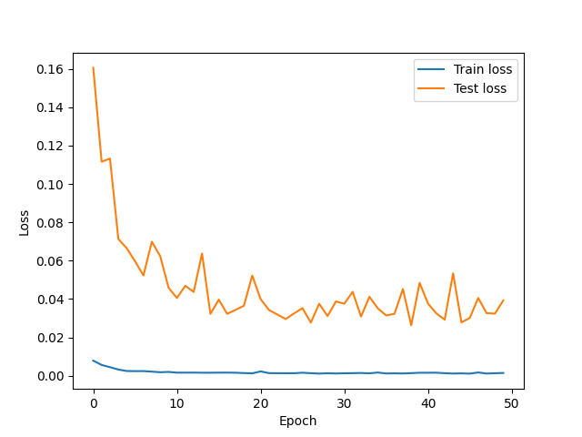
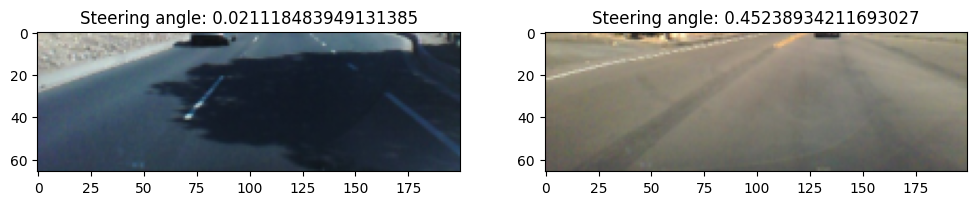
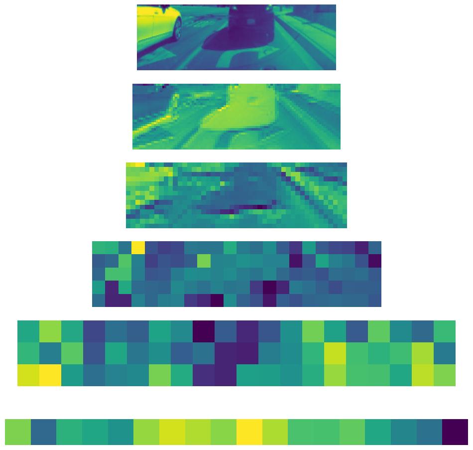

# Collection of End-To-End pipelines for Self Driving
Mostly Deep Learning based.

Implementation of : https://arxiv.org/abs/1604.07316
*DAVE2 - Train & Test Loss => 50 epochs.*

*Processed data examples*

*What the model sees on each layer*

## Some resources
https://gitlab.com/ub-dems-public/cs-labs/user-ariboni/csp-drive-dl
https://github.com/saireddyavs/Self-Driving-Cars-Using-Keras/blob/master/README.md

